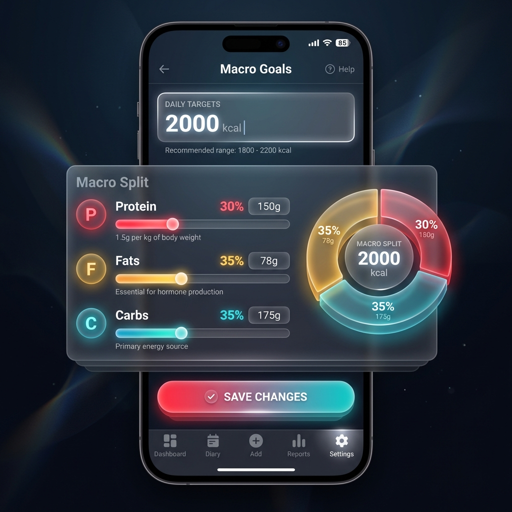

# Macro Settings Design

## Overview
This document outlines the design for allowing users to customize their daily calorie and macronutrient goals.

## UX Design
The settings screen will follow the "Immersive Utility" glassmorphism aesthetic.

### Visual Mockup


### Interaction Flow
1.  **Entry Point**: Navigation Bar -> Settings.
2.  **Input**:
    *   **Daily Calories**: Numeric input (e.g., 2000).
    *   **Macros**: Three sliders/inputs for Protein, Fat, Carbs.
        *   Primary input: Grams.
        *   Secondary display: Percentage of total calories.
        *   *Logic*: Changing grams updates percentage. Changing calories updates percentages (keeping grams constant).
3.  **Visualization**: A donut chart reflecting the current macro split (Calorie contribution).
4.  **Save**: "Save Goals" button dispatches the update event and persists to local storage / backend.

## Technical Implementation

### 1. Data Model (Redux Store)

We will introduce a new `settings` slice to the Redux store.

**State Interface:**
```typescript
interface MacroTargets {
  calories: number;
  protein: number;
  fat: number;
  carbs: number;
}

interface SettingsState {
  targets: MacroTargets;
}

const initialSettings: SettingsState = {
  targets: {
    calories: 2000,
    protein: 150,
    fat: 70,
    carbs: 200
  }
};
```

### 2. Event Sourcing (`events`)

We will define a new event type to track these changes over time.

**Event Type:** `settings/goalsUpdated`

**Payload:**
```typescript
{
  targets: MacroTargets;
}
```

### 3. Store Integration (`store.ts`)

*   **New Slice**: `settingsSlice`
*   **Reducer**: Handles `settings/goalsUpdated` by replacing the current `targets`.
*   **Selectors**:
    *   `selectMacroTargets`: Returns the current targets.
    *   `selectDailyProgress`: (Updated) Returns current progress relative to these dynamic targets.

### 4. Persistence
*   Settings should be persisted to `localStorage` or the Google Sheet "Config" tab to survive reloads.
*   *MVP approach*: Persist to `localStorage` first, sync to Sheet later.

## UI Components to Update
1.  `src/routes/settings/+page.svelte`: Implement the new form.
2.  `src/lib/components/DailyRings.svelte`: Subscribe to `selectMacroTargets` to compute progress percentages.
