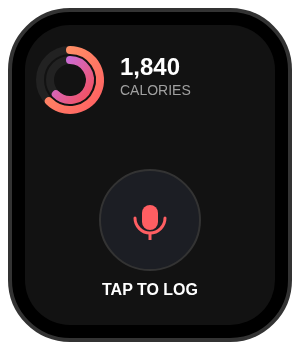
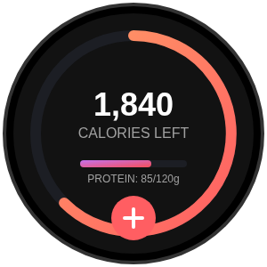

# Wearables Design Strategy: Immersive Utility on the Wrist

## 1. Introduction
The Food app’s philosophy of **"Immersive Utility"**—making logging magical and data rewarding—is uniquely suited for wearables. On Android Wear (Wear OS) and Apple Watch (watchOS), the goal is to eliminate the friction of pulling out a phone. By bringing calorie awareness and "one-tap" logging to the wrist, we move from being a tool the user *uses* to an ambient partner in their health journey.

## 2. Analysis of Alternatives

### 2.1 Dedicated Watch App
A full-featured application that mirrors the phone experience.
*   **Pros:** Access to history, detailed macro breakdowns, and manual search.
*   **Cons:** High interaction friction on small screens. Typing or navigating lists is cumbersome.
*   **Verdict:** Necessary as a background engine, but not the primary interface for daily logging.

### 2.2 Watch Face
A custom watch face that replaces the user’s primary clock.
*   **Pros:** Maximum visibility; the app *is* the watch.
*   **Cons:** Users are often loyal to their existing watch faces (especially on Apple Watch where custom faces are limited). Extremely complex to implement and maintain.
*   **Verdict:** Post-Grand Vision. Too high-friction for an MVP.

### 2.3 Complications (watchOS) & Tiles (Wear OS)
Small data widgets and full-screen glanceable cards.
*   **Pros:** **Glanceability.** Information is available at a flick of the wrist. Tiles on Wear OS provide a dedicated "page" just one swipe away from the clock.
*   **Cons:** Limited space for complex interactions.
*   **Verdict:** **The Winning Strategy.** Use these as the primary entry points for quick awareness and action.

---

## 3. Recommendations

### 3.1 MVP: The "Quick-Log" Bundle
The MVP focuses on the most frequent interaction: checking remaining calories and logging a meal.

1.  **Glanceable Tile/Complication**: Displays the central Calorie Ring (from `UI_OVERHAUL.md`) showing progress toward the daily goal.
2.  **Voice-First Input**: Tapping the Tile/Complication immediately launches the microphone. The user says *"12oz coffee with splash of milk"* and the watch hands off the transcription to the Gemini-powered backend for analysis.
3.  **Haptic Confirmation**: A subtle "success" vibration once the AI confirms the log.

### 3.2 Grand Vision: "Ambient Nutrition Awareness"
The end goal is a standalone wearable experience that integrates deeply with health sensors.

*   **Standalone Operation**: Logging works via LTE/WiFi without the phone present.
*   **Biometric Integration**: Correlate heart rate spikes or activity bursts with logging prompts (e.g., *"Just finished a workout? Log your recovery snack."*).
*   **Location-Based Suggestions**: Using GPS to suggest "usuals" when at a known restaurant or at home.
*   **Optical Nutrition**: (Speculative) Using the watch camera (where available) or synced phone camera sessions to provide real-time AR feedback on the wrist.

---

## 4. Visual Mockups

### Apple Watch (watchOS) - "Infograph" Complication & Voice App
Focuses on the rounded rectangle aesthetic, using high-contrast neon gradients.

### Android Wear (Wear OS) - Summary Tile
A circular dashboard optimized for glanceable progress and quick action.

