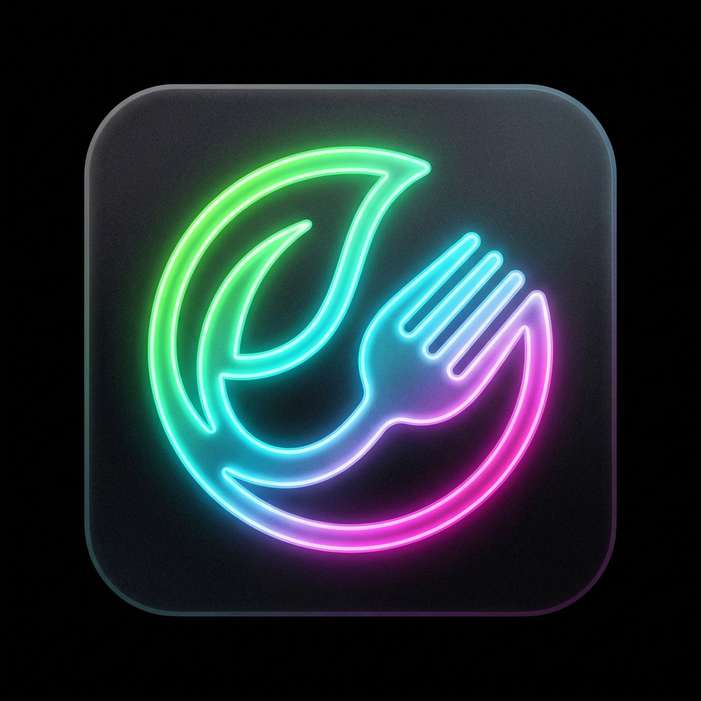
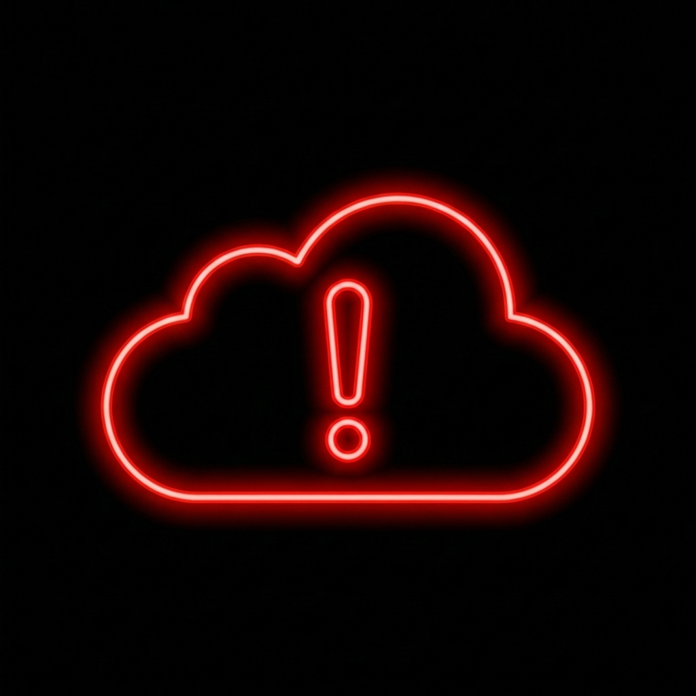
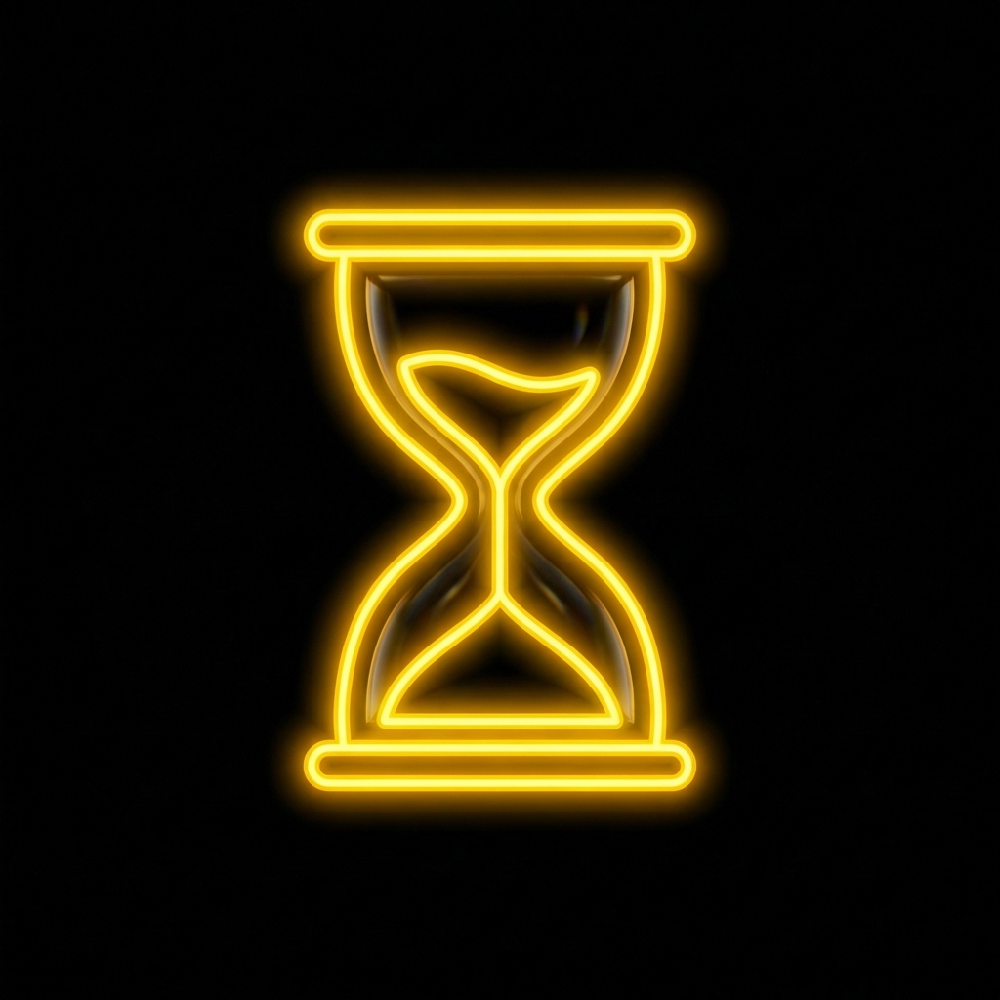
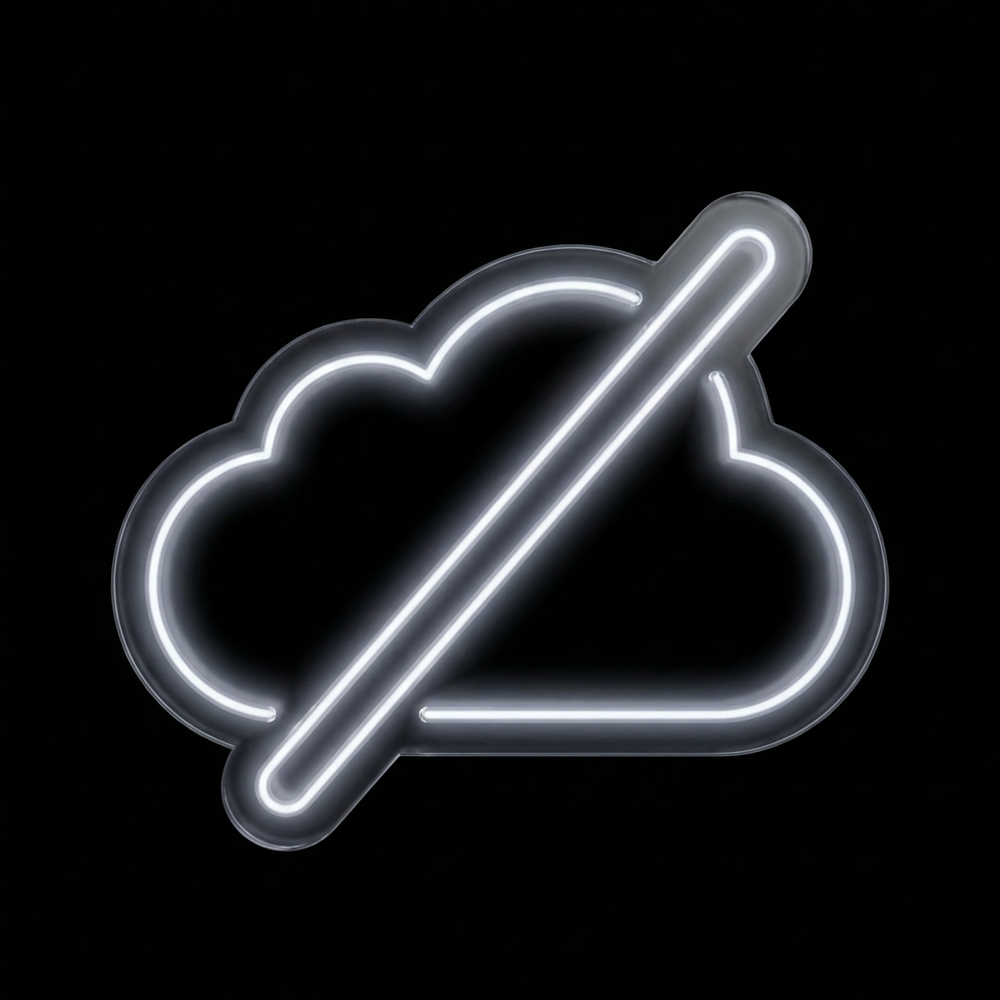

# Graphics Fixups Walkthrough

We have successfully updated the application graphics to a unified "glassmorphic neon on black" style.

## Changes

### Application Identity
- **App Icon**: Generated a new neon healthy-food icon on a pure black background.
  - `static/apple-touch-icon.png` (Source)
  - `static/android-chrome-192x192.png` (Resized via Nix/ImageMagick)
  - `static/android-chrome-512x512.png` (Resized via Nix/ImageMagick)



### Sync Status Indicators
- **Sync Failure**: Neon red exclamation/cloud.
- **Pending**: Neon yellow hourglass (No text).
- **Offline**: Neon grey/white disconnected cloud (No text).
- **Synced**: Kept existing icon as requested by user.

````carousel

<!-- slide -->

<!-- slide -->

````

## Configuration Updates
- Added `imagemagick` to `flake.nix` to support reliable CLI image resizing.

render_diffs(file:///Users/anicolao/projects/antigravity/food/flake.nix)

## Verification Results
- **Files Verified**: verified existence and sizing of generated Android icons in `static/`.
- **Method**: Manual copy by user + `nix develop -c magick` for resizing to ensure proper PNG format.
- **CI Adjustments**: Increased E2E screenshot tolerance to 200 pixels to account for cross-platform rendering differences.
