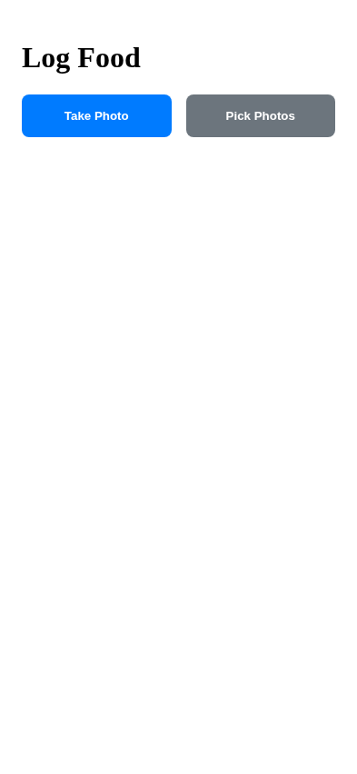
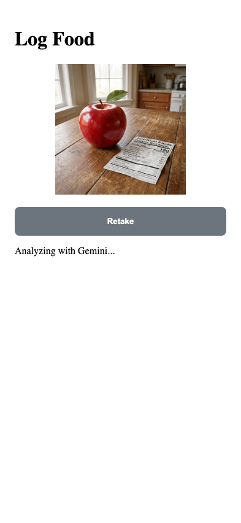
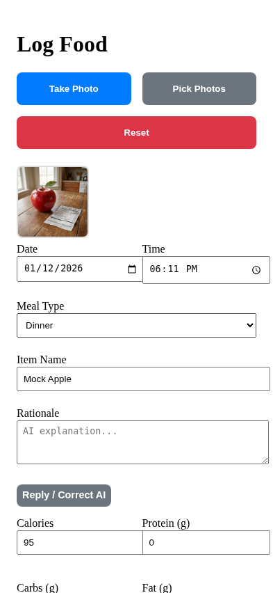
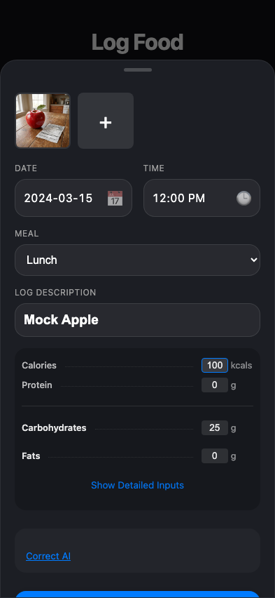
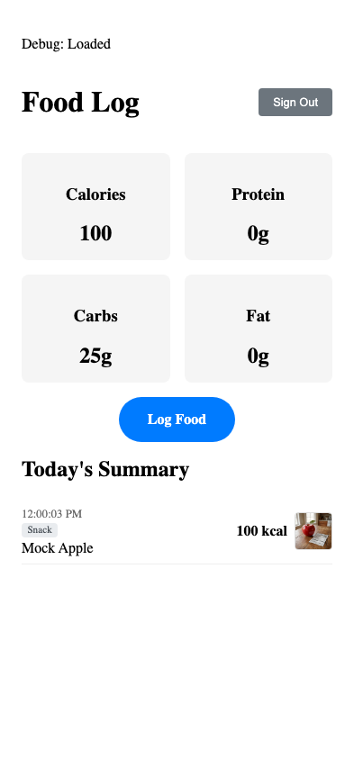

# Test: US-003 to US-010: User logs food flow

## User on log page

**Verifications:**
- [x] Upload button visible

---

## Image preview shown

**Verifications:**
- [x] Preview visible
- [x] Status is Analyzing

---

## AI Analysis Received

**Verifications:**
- [x] Calories populated

---

## User corrects analysis

**Verifications:**
- [x] Calories updated to 100

---

## Returned to Dashboard

**Verifications:**
- [x] On Dashboard
- [x] Calories updated
- [x] History name shown
- [x] Meal type shown
- [x] Thumbnail shown
- [x] Thumbnail loaded

---

