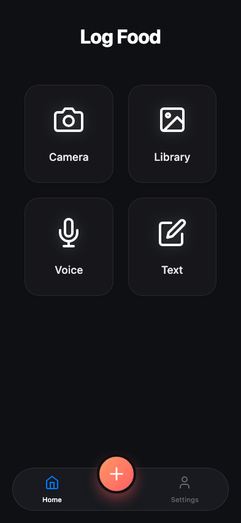
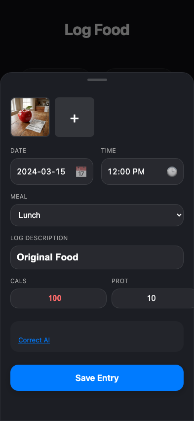
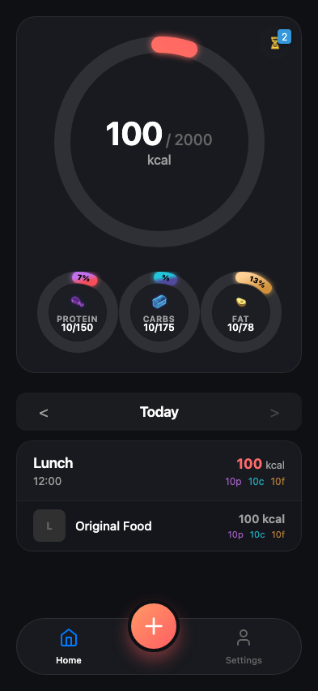
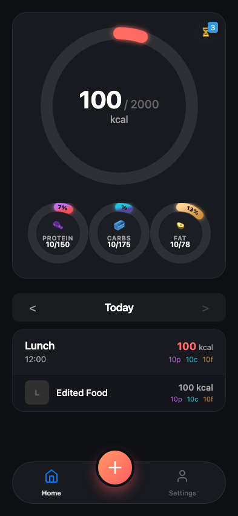
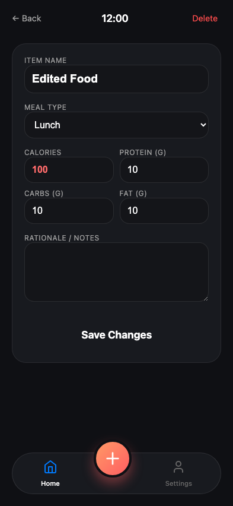

# Test: Bug Repro: Edit Persistence on Re-open

## User opens the log page

**Verifications:**
- [x] Camera button visible

---

## User uploads image and waits for analysis

**Verifications:**
- [x] Description populated

---

## User saves the entry

**Verifications:**
- [x] Original food visible in list

---

## User edits the existing entry

**Verifications:**
- [x] Edited food visible in list

---

## Edited value persists after reload

**Verifications:**
- [x] Detail view shows edited name

---

