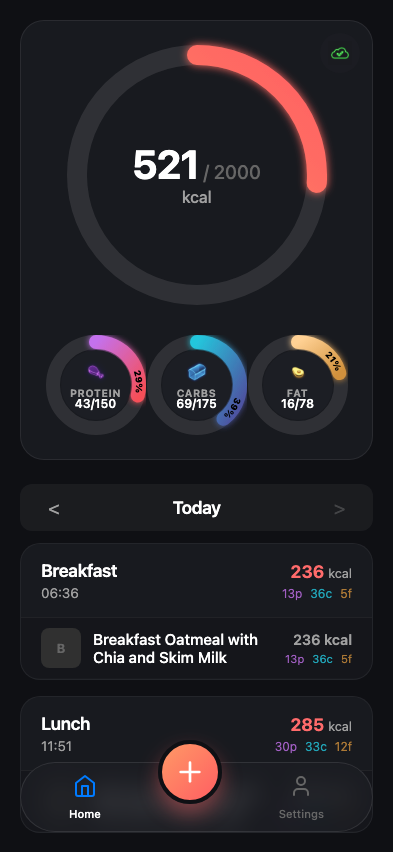
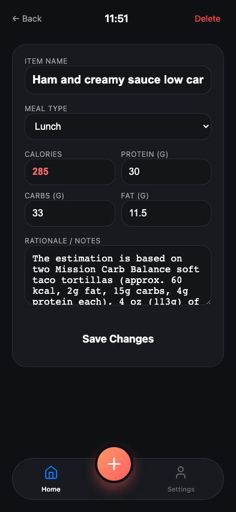

# Test: US-012: User edits entry rationale (Mirrors Unit Test)

## Dashboard loaded with seeded data

**Verifications:**
- [x] Lunch entry visible
- [x] Calories correct

---

## Entry updated with new rationale

**Verifications:**
- [x] Rationale contains new text
- [x] Specific phrase present

---

