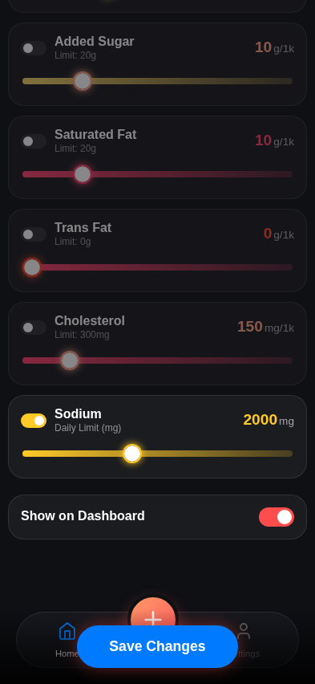
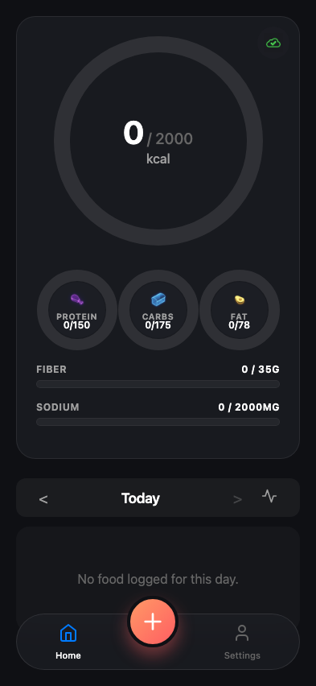
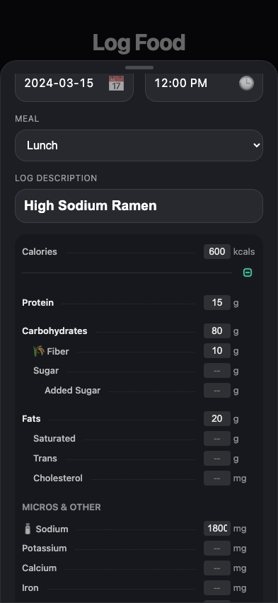
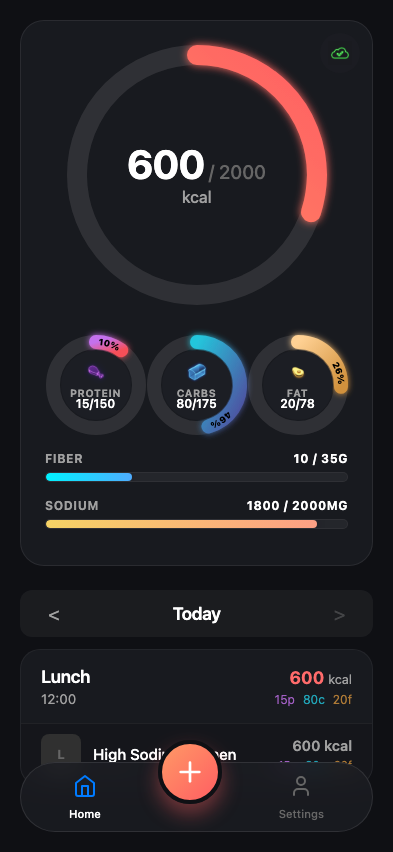
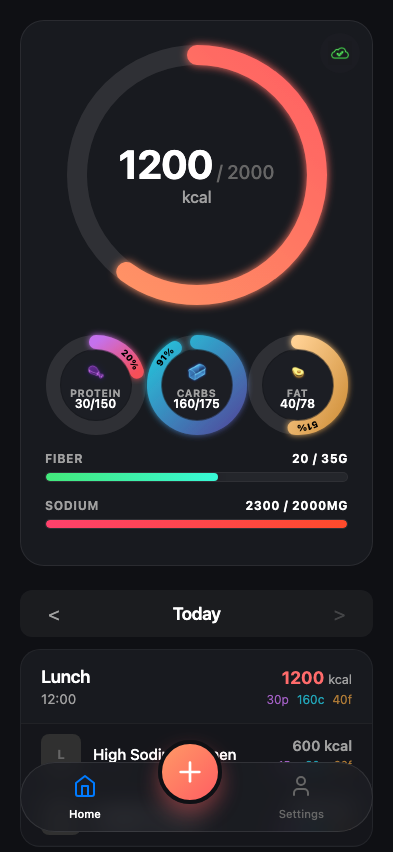
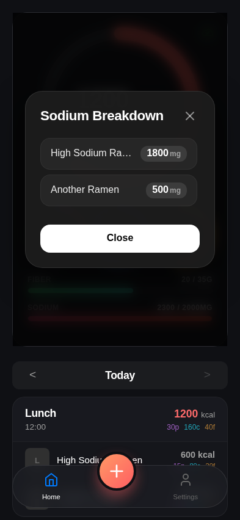

# Test: US-015: Fiber and Sodium tracking

## Health targets configured in settings

**Verifications:**
- [x] Fiber input updated
- [x] Sodium limit input updated

---

## Health summary visible on dashboard

**Verifications:**
- [x] Fiber bar visible
- [x] Fiber target is 35g
- [x] Sodium bar visible
- [x] Sodium target is 2000mg

---

## Nutrition form shows fiber and sodium icons

**Verifications:**
- [x] Fiber icon visible
- [x] Sodium icon visible

---

## Sodium bar reflects increase

**Verifications:**
- [x] Sodium value updated
- [x] Fiber value updated

---

## Sodium bar turns red when limit exceeded

**Verifications:**
- [x] Sodium total is 2300mg
- [x] Bar is red

---

## Sodium breakdown modal shows detailed logs

**Verifications:**
- [x] Modal is visible
- [x] Modal title is correct
- [x] First item is High Sodium Ramen (1800mg)
- [x] Second item is Another Ramen (500mg)

---

