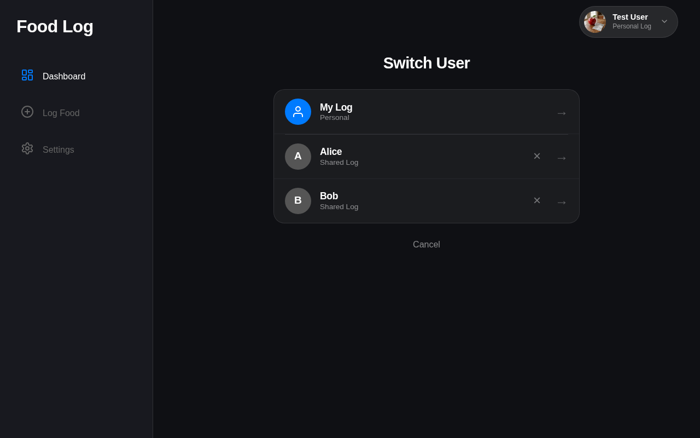
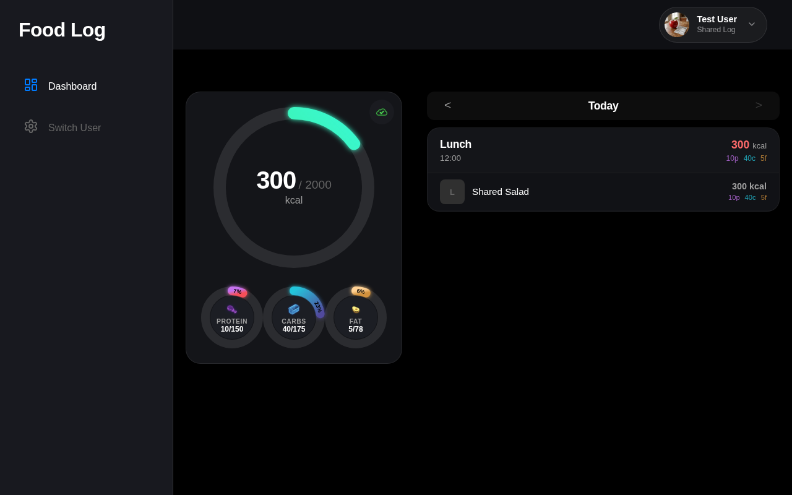
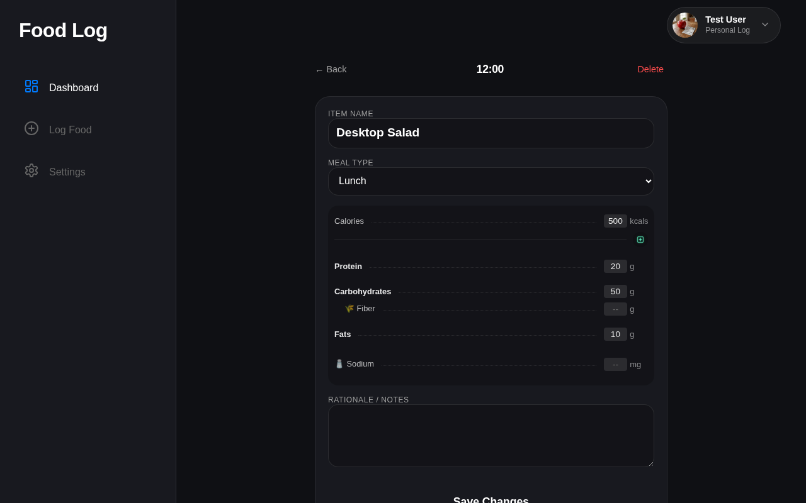

# Test: US-112: Desktop Layout and Navigation

## Dashboard shows desktop layout

**Verifications:**
- [x] Sidebar visible
- [x] Mobile nav hidden
- [x] Header visible

---

## Log page in desktop layout

**Verifications:**
- [x] Sidebar still visible

---

## Settings page in desktop layout

**Verifications:**
- [x] Goals header visible

---

## Switcher page in desktop layout

**Verifications:**
- [x] Mock users visible

---

## Sharing page in desktop layout

**Verifications:**
- [x] Sidebar shows Switch User
- [x] Shared header visible

---

## Entry Details page in desktop layout

**Verifications:**
- [x] Back link visible
- [x] Nutrition info visible

---

