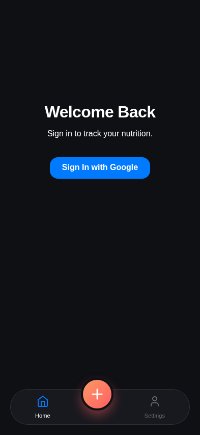
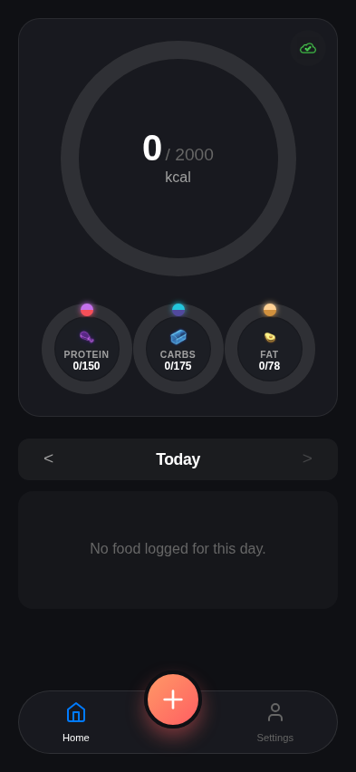

# Test: Issue #95: Auth Refresh Robustness

## Verify logout if refresh hangs and token is expired

**Verifications:**
- [x] Logs out after 10s if token expired

---

## Verify app stays logged in if refresh hangs but token still valid (in buffer)

**Verifications:**
- [x] Remains logged in if within buffer

---

