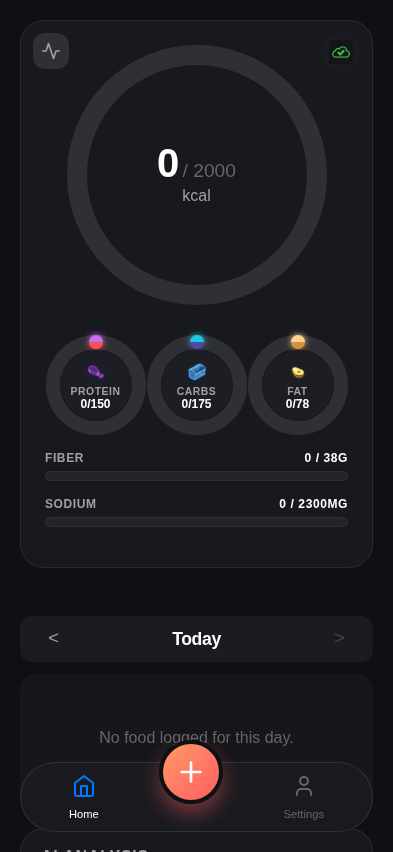
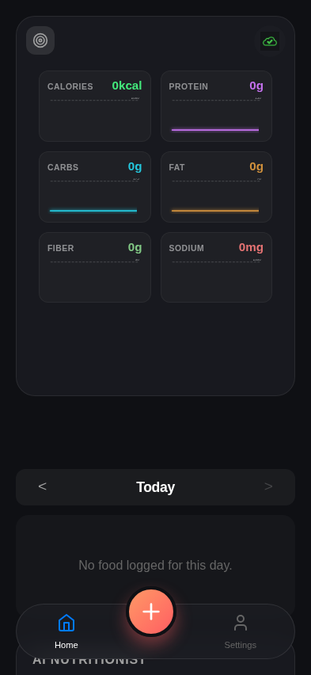

# Test: US-114: EMA Mobile Layout and Target/Limit Lines

## Dashboard on mobile initially shows rings

**Verifications:**
- [x] Trends button exists
- [x] Card is not flipped

---

## Trends are visible on the back of the card after flipping

**Verifications:**
- [x] Card is flipped
- [x] Calories graph is shown

---

## Graphs show target and limit lines

**Verifications:**
- [x] Calories graph has target line
- [x] Sodium graph has limit line

---

