# Test: US-112: Desktop Layout and Navigation

## Dashboard shows desktop layout

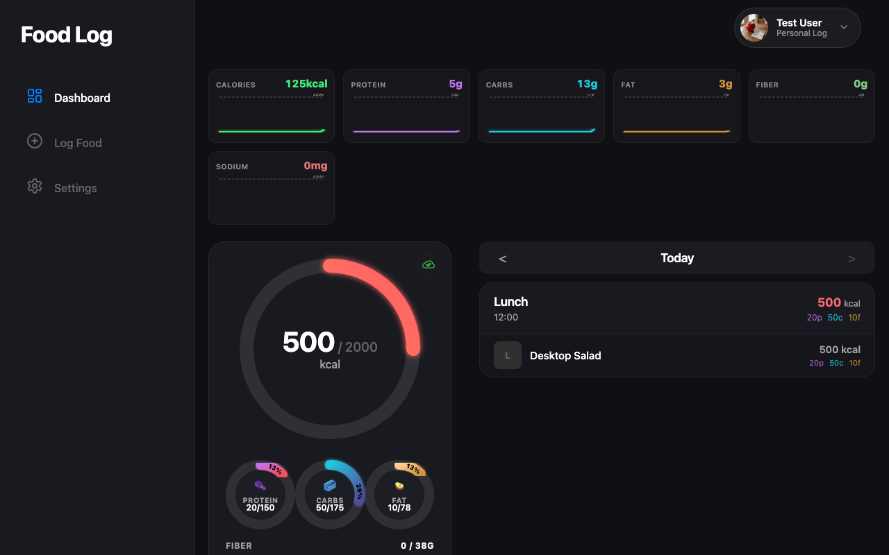

**Verifications:**
- [x] Sidebar visible
- [x] Mobile nav hidden
- [x] Header visible

---

## Settings page in desktop layout

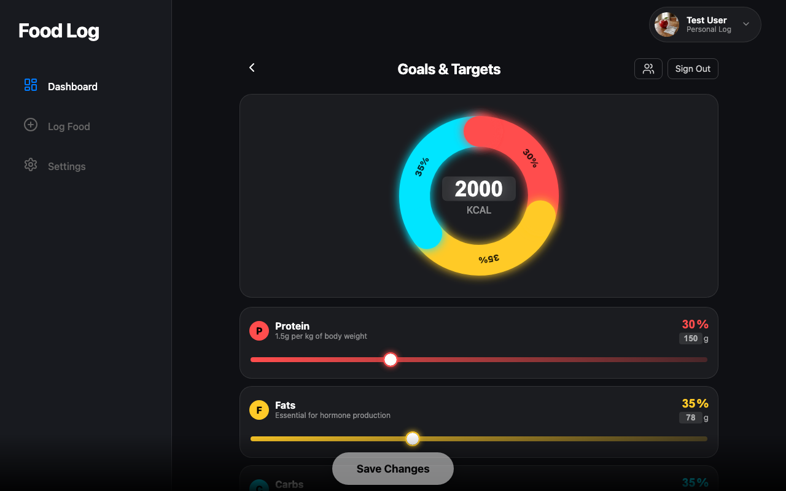

**Verifications:**
- [x] Goals header visible

---

## Health summary with Fiber and Sodium visible on desktop dashboard

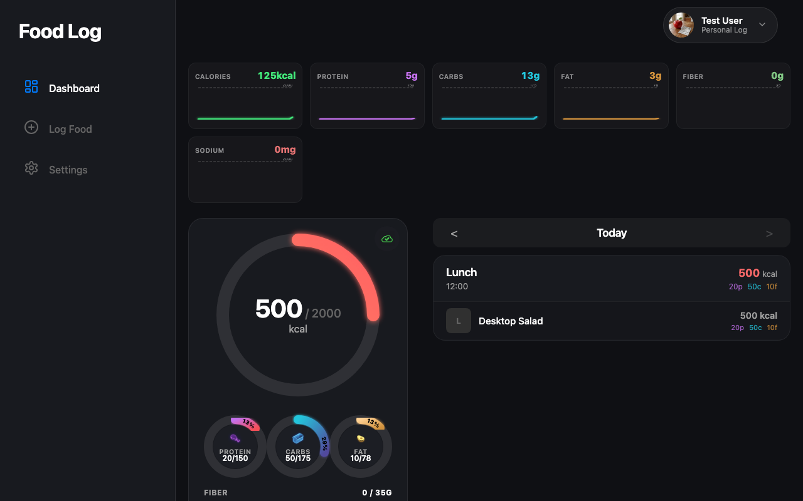

**Verifications:**
- [x] Fiber bar visible
- [x] Sodium bar visible

---

## Log page in desktop layout

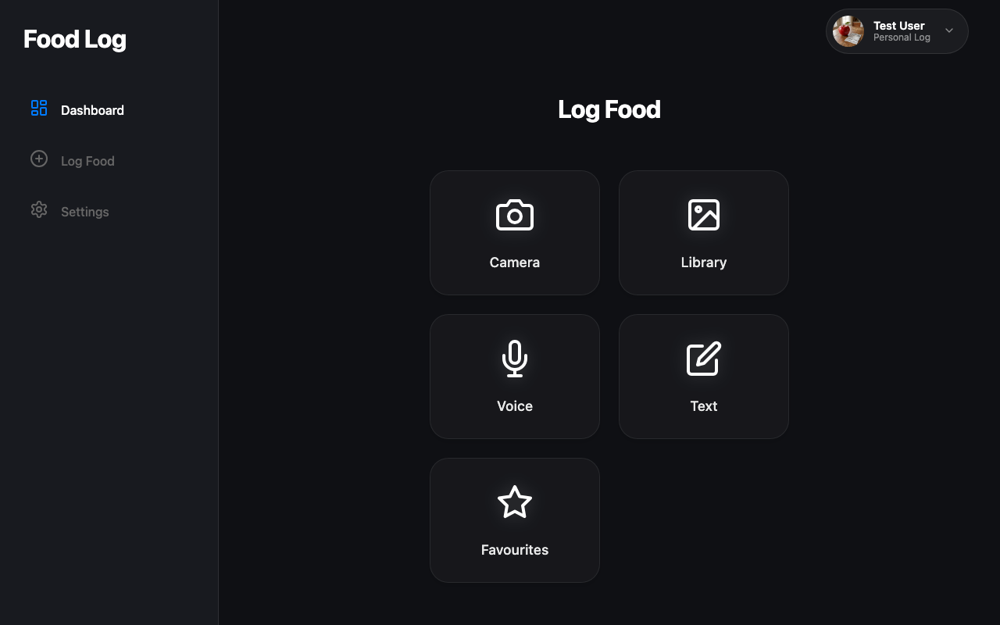

**Verifications:**
- [x] Sidebar still visible

---

## Log form shows pinned Fiber and Sodium on desktop

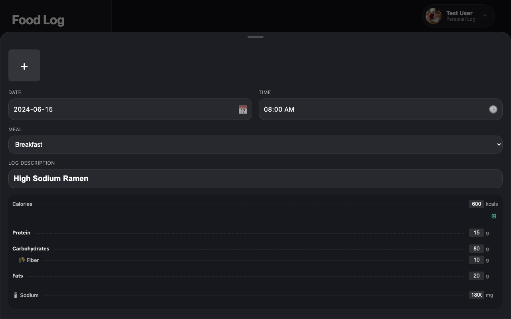

**Verifications:**
- [x] Fiber pinned
- [x] Sodium pinned

---

## Expanded log form on desktop

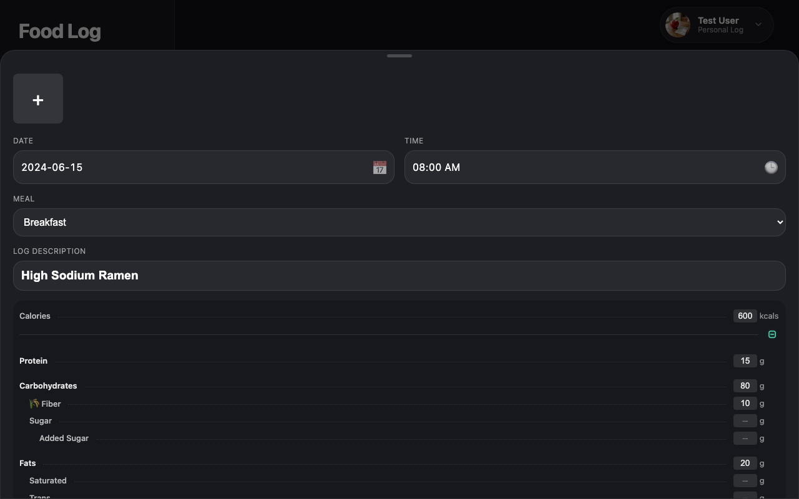

**Verifications:**
- [x] Sugar visible

---

## Health breakdown modal on desktop

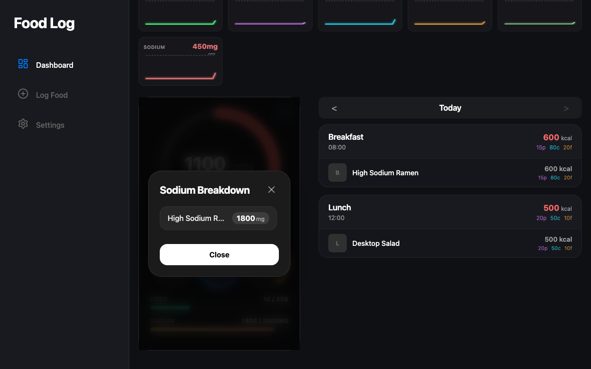

**Verifications:**
- [x] Modal is visible
- [x] Modal title is correct

---

## Network & Sync page in desktop layout

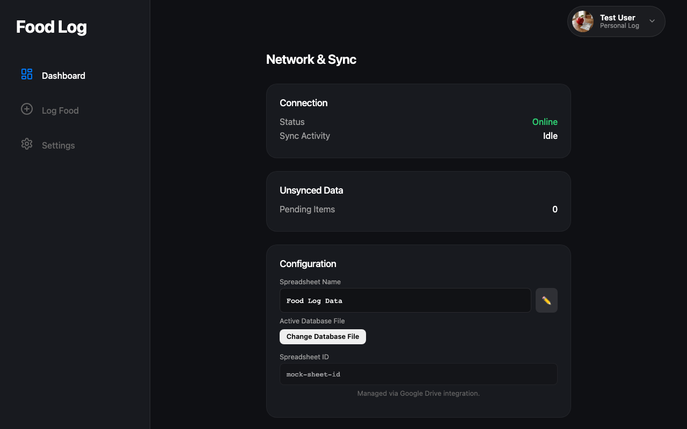

**Verifications:**
- [x] Heading visible

---

## Switcher page in desktop layout

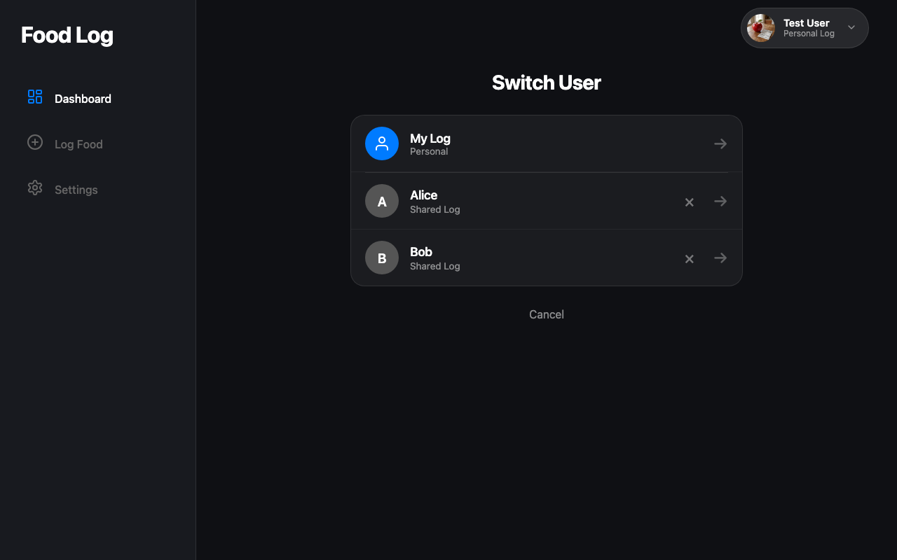

**Verifications:**
- [x] Mock users visible

---

## Privacy page in desktop layout

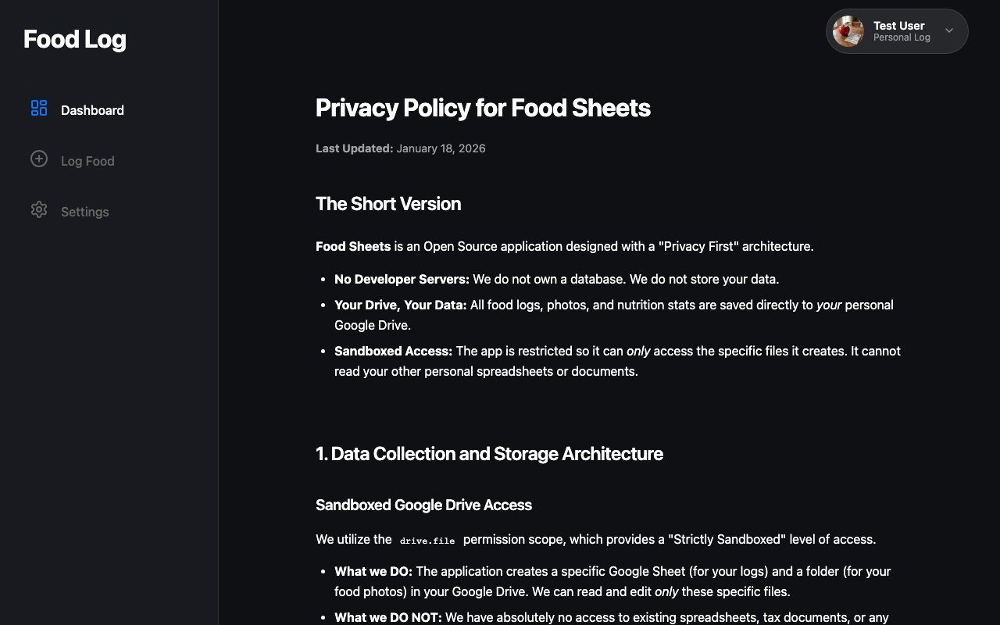

**Verifications:**
- [x] Heading visible

---

## Sharing page in desktop layout

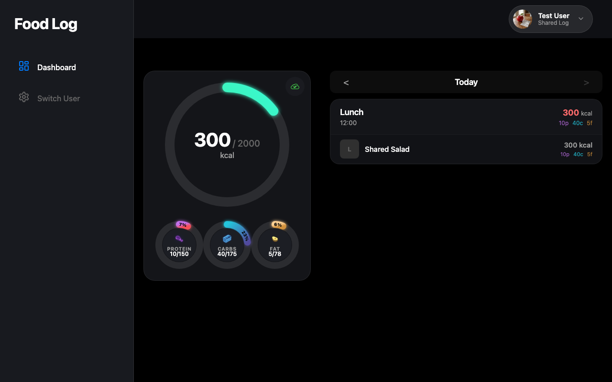

**Verifications:**
- [x] Sidebar shows Switch User
- [x] Shared header visible

---

## Entry Details page in desktop layout

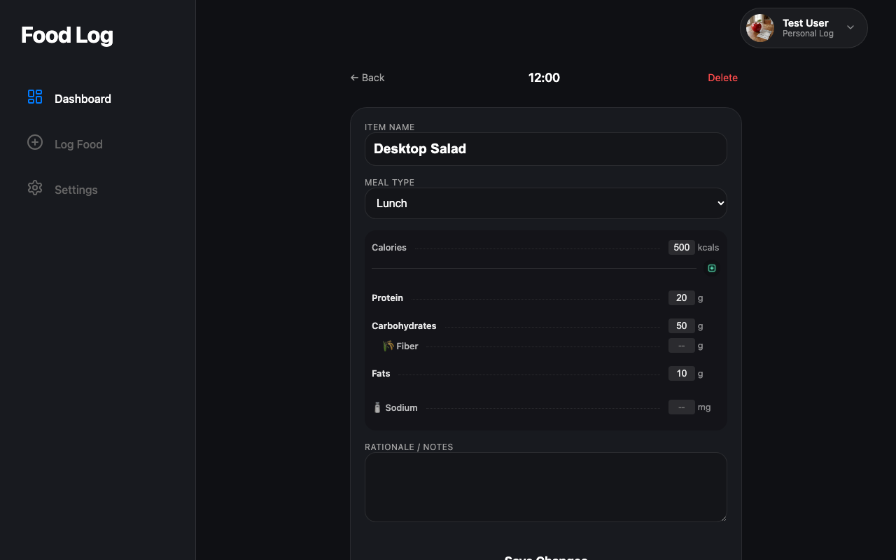

**Verifications:**
- [x] Back link visible
- [x] Nutrition info visible

---

## Edit flow in desktop layout

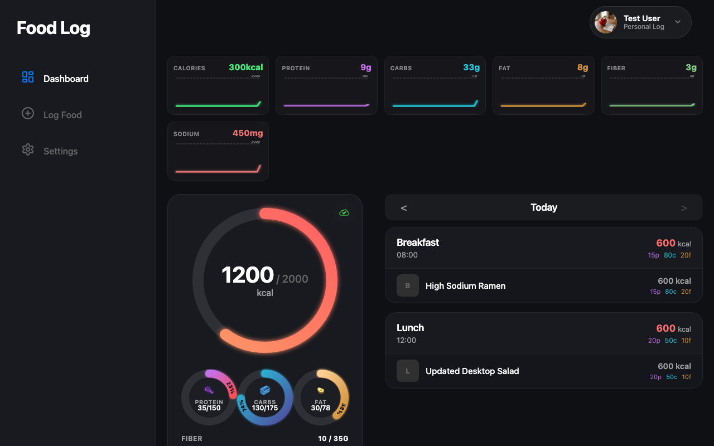

**Verifications:**
- [x] Updated name visible
- [x] Updated calories visible

---

