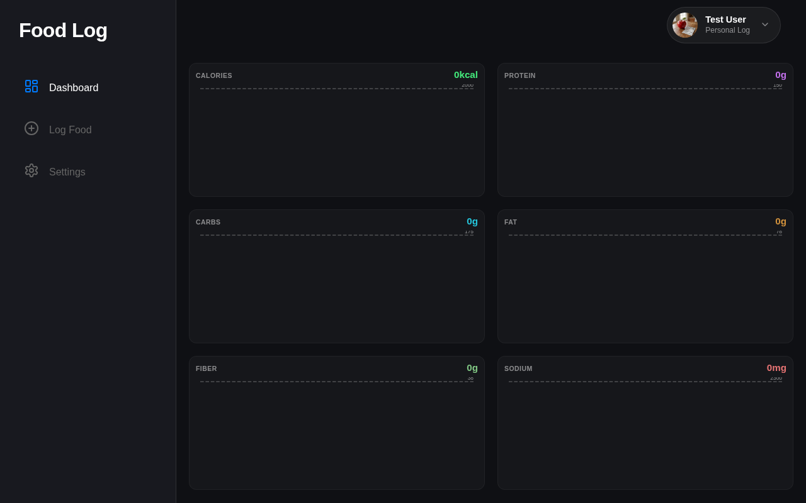
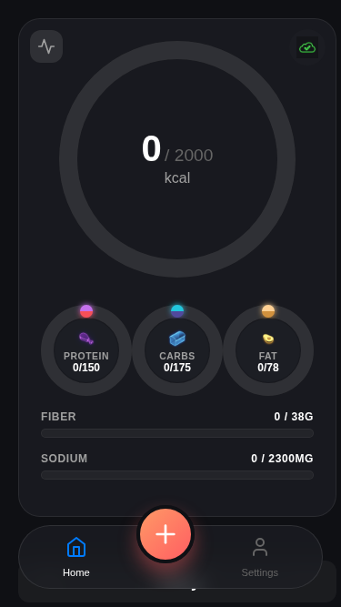
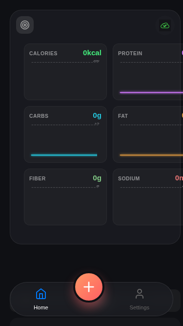
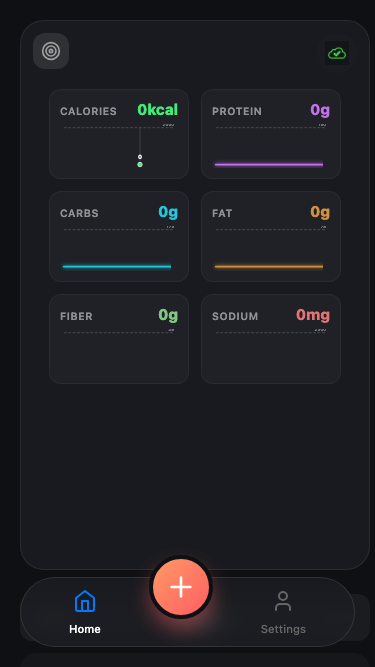

# Test: US-114: EMA Graphs

## EMA graphs are visible on desktop

**Verifications:**
- [x] Desktop EMA wrapper visible
- [x] Calories EMA chart exists
- [x] Fiber EMA chart exists

---

## EMA graphs are hidden on mobile by default (on back of card)

**Verifications:**
- [x] Card is not flipped
- [x] Toggle button exists

---

## EMA graphs are visible on mobile after flip

**Verifications:**
- [x] Card is flipped
- [x] Protein EMA chart exists
- [x] Sodium EMA chart exists

---

## Hovering on an EMA chart shows indicator and value

**Verifications:**
- [x] Hover on Calories chart shows value

---

